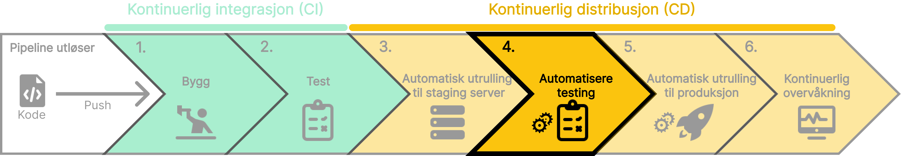

I en CI/CD-pipeline er det viktig å automatisere testingen for å sikre at koden er av høy kvalitet og fungerer som forventet.
Jenkins har innebygde funksjoner for å automatisere testingen i en CI/CD-pipeline. Dette kan inkludere testtypene nevnt i **[Fase 2: Testing](../../ci/test)**. Implementasjon av automatiserte tester gir følgende fordeler:

- **Tidlig oppdagelse av feil**: Reduserer risikoen for at feil slipper gjennom til produksjon.
- **Rask tilbakemelding**: Automatiserte tester gir rask tilbakemelding på kvaliteten til koden din.
- **Effektivitet**: Raskere og mer pålitelige enn manuelle tester, spesielt i store prosjekter.

import SelectCorrect from "../../../../components/SelectCorrect.astro";

<SelectCorrect
  question="Hva er formålet med å automatisere testingen i en CI/CD-pipeline?"
  correct="For å sikre at koden er av høy kvalitet og fungerer som forventet."
  wrong1="For å teste koden i et realistisk miljø før den rulles ut til produksjon."
  wrong2="For å overvåke ytelsen og tilstanden til applikasjonen."
/>

import LikeThisPage from "../../../../components/LikeThisPage.astro";

<LikeThisPage />
