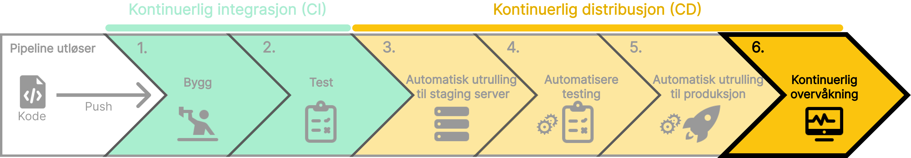

Etter at koden er utplassert til produksjon, er det viktig å kontinuerlig overvåke ytelsen og tilstanden til applikasjonen. Kontinuerlig overvåkning spiller en kritisk rolle i å sikre at applikasjonen fungerer som forventet, og bidrar til å oppdage og løse problemer. Alle feil og problemer bør loggføres og håndteres raskt for å sikre en god brukeropplevelse.

## Hvorfor kontinuerlig overvåkning?

- **Forbedret brukeropplevelse**: Sikrer at applikasjonen fungerer som forventet.
- **Optimalisering av ytelsen**: Identifiserer flaskehalser og forbedrer ytelsen.
- **Sikkerhet**: Oppdager og håndterer sikkerhetstrusler raskt.

import SelectCorrect from "../../../../components/SelectCorrect.astro";

<SelectCorrect
    question="Hva er formålet med kontinuerlig overvåkning av applikasjonen?"
    correct="For å sikre at applikasjonen fungerer som forventet og oppdage problemer raskt."
    wrong1="For å teste koden i et realistisk miljø før den rulles ut til produksjon."
    wrong2="For å forbedre brukergrensesnittet til applikasjonen."
/>

import LikeThisPage from "../../../../components/LikeThisPage.astro";

<LikeThisPage />
