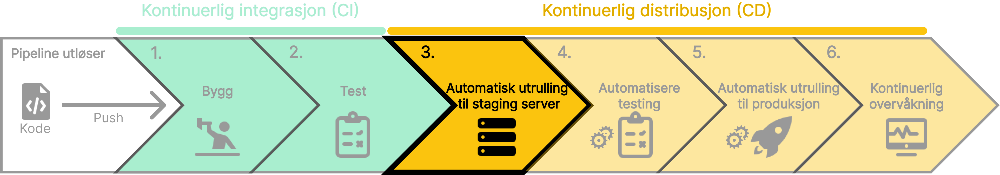

Når koden er bygget og testet, er det neste steget å utplassere den til en staging server. En staging server er en **_kopi av produksjonsmiljøet_** som brukes til å teste koden før den rulles ut til produksjon.
Jenkins kan hjelpe deg med å automatisere utplasseringsprosessen, slik at du raskt og effektivt kan teste koden din i et realistisk miljø før den rulles ut til produksjon. Dette sikrer at alt fungerer som forventet før koden når sluttbrukeren.

### Hvorfor utplassere til en staging server?

- **Teste i et realistisk miljø**: Koden testes i et miljø som ligner produksjonsmiljøet.
- **Automatisert utplassering**: Raskere og mer effektiv testing
- **Muligheter for rollback**: En enkel og rask tilbakekalling av endringer hvis det oppstår problemer.
- **Pålitelighet**: Sikrer konsistent drift i et staging-miljø før produksjon.

import SelectCorrect from "../../../../components/SelectCorrect.astro";

<SelectCorrect
  question="Hva er formålet med å utplassere koden på en staging server?"
  correct="For å teste koden i et realistisk miljø før den rulles ut til produksjon."
  wrong1="For å rulle ut koden til produksjon."
  wrong2="For å lagre koden på en midlertidig server."
/>

import LikeThisPage from "../../../../components/LikeThisPage.astro";

<LikeThisPage />
