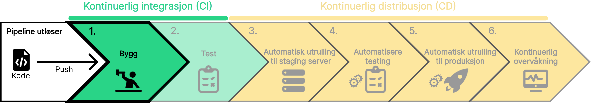
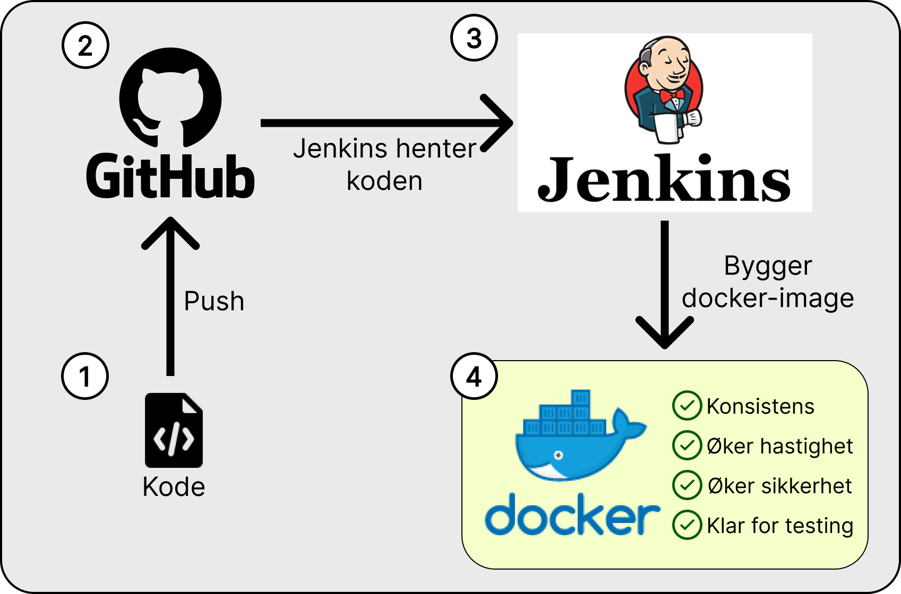

Når kodenendringen blir pushet til GitHub (versjonskontrollserver), utløses CI/CD-pipelinen automatisk. Pipelinen starter med byggfasen. I denne fasen bygges prosjektet fra kildekode om til et kjørbart format. Dette inkluderer følgende trinn:

1. **Kompilering av kode**: Koden oversettes fra kildekode (f.eks Java, C++ eller Python) til maskinlesbar kode.
2. **Innsamling av avhengigheter**: Biblioteker og andre nødvendigheter lastes ned og inkluderes i byggeprosessen.
3. **Pakking**: Den kompilerte koden og avhengighetene pakkes sammen til et distribuert format. (f.eks et Docker-image).

## Jenkins og Docker

Jenkins er et verktøy som automatiserer hele CI/CD prosessen. Verktøyet integreres med versjonskontrollserver for å bygge, teste og utplassere koden automatisk hver gang endringer dyttes. Jenkins har et bredt spekter av plugins for å tilpasse pipelinene til utviklerens behov.

Docker er et verktøy som dekker trinn 3 i byggfasen. Fordelen ved å bruke Docker er at applikasjonen fungerer konsistent på tvers av forskjellige miljøer. Docker tilføyer også sikkerhet, ettersom koden blir pakket inn i en container.
Dette gir utvikleren en effektiv, konsistent og automatisert utviklings- og utrullingsprosess.

Ved å bruke både Docker og Jenkins kan utvikleren:

- Bygge applikasjonen i Jenkins
- Pakke den i en Docker-container
- Automatisere testing og utplassering med Jenkins.

import SelectCorrect from "../../../../components/SelectCorrect.astro";

<SelectCorrect
  question="Hvorfor bygger vi koden vår før vi tester den?"
  correct="For å kompilere og pakke koden slik at den kan kjøres på en maskin."
  wrong1="For å teste at koden fungerer som forventet."
  wrong2="For å finne syntaksfeil i koden."
/>

import LikeThisPage from "../../../../components/LikeThisPage.astro";

<LikeThisPage />
