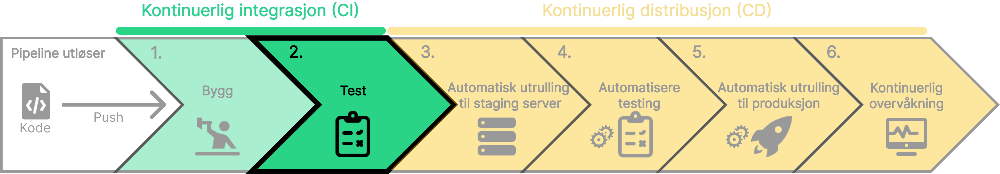

Etter at byggprosessen er fullført, er det viktig å teste koden din for å sikre at den fungerer som forventet.
Dette kan inkludere **_enhetstester_**, **_integrasjonstester_** og **_ende-til-ende_** tester.

- **_Enhetstester_** fokuserer på å teste individuelle komponenter eller funksjoner i koden din.

- **_Integrasjonstester_** tester hvordan disse komponentene samhandler.

- **_Ende-til-ende_** tester simulerer brukerinteraksjoner for å teste hele applikasjonen.

Testing er en essensiell del av CI/CD-prosessen og bidrar til å oppdage feil tidlig i utviklingssyklusen.

### Eksempel: Enhetstest

Applikasjonen vår har en funksjon for å legge til kommentarer. Vi ønsker å teste at denne funksjonen fungerer som forventet. Vi kan skrive en **_enhetstest_** for å sjekke at en kommentar blir lagt til i databasen når brukeren trykker på "Legg til kommentar" knappen.

<details open>
<summary>Enhetstest eksempel</summary>
```javascript
test("Legg til kommentar", () => {
  // Simulerer brukerens input
  userEvent.type(screen.getByLabelText("Kommentar"), "Dette er en kommentar");
  userEvent.click(screen.getByText("Legg til kommentar"));

// Sjekker at kommentaren er lagt til i databasen
expect(screen.getByText("Dette er en kommentar")).toBeInTheDocument();
});

```
</details>

### Eksempel: Integrasjonstest

Applikasjonen består av en frontend og en backend. Vi vil teste at frontend og backend kommuniserer riktig. Vi kan skrive en **_integrasjonstest_** for å bekrefte at frontend kan hente data fra backend. Integrasjonstesten kan kjøres i en Docker container for å isolere testene fra resten av systemet.

<details>
<summary>Integrasjonstest eksempel</summary>
```javascript
test("Hente data fra backend", async () => {
  // Starter frontend og backend i Docker container
  const { frontend, backend } = await startContainers();

  // Henter data fra backend
  const data = await frontend.getData();

  // Sjekker at data er hentet riktig
  expect(data).toEqual({ message: "Hello, world!" });

  // Stopper Docker containerne
  await stopContainers(frontend, backend);
});
```

</details>

### Eksempel: Ende-til-ende test

Vi vil teste at hele applikasjonen fungerer som forventet når en bruker logger inn og legger til en kommentar.
Vi kan skrive en **_ende-til-ende test_** for å simulere disse brukerinteraksjonene.

<details>
<summary>Ende-til-ende eksempel</summary>
```javascript
test("Legg til kommentar etter innlogging", async () => {
  // Simulerer brukerens innlogging
  userEvent.type(screen.getByLabelText("Brukernavn"), "testbruker");
  userEvent.type(screen.getByLabelText("Passord"), "hemmelig");
  userEvent.click(screen.getByText("Logg inn"));

// Simulerer brukerens input
userEvent.type(screen.getByLabelText("Kommentar"), "Dette er en kommentar");
userEvent.click(screen.getByText("Legg til kommentar"));

// Sjekker at kommentaren er lagt til i databasen
expect(screen.getByText("Dette er en kommentar")).toBeInTheDocument();
});

```
</details>

import SelectCorrect from "../../../../components/SelectCorrect.astro";

<SelectCorrect
  question="Hva er formålet med enhetstester?"
  wrong2="Å teste hele applikasjonen fra start"
  correct="Å teste individuelle komponenter eller funksjoner i koden."
  wrong1="Å teste hvordan komponentene samhandler."
/>

import LikeThisPage from "../../../../components/LikeThisPage.astro";

<LikeThisPage />
