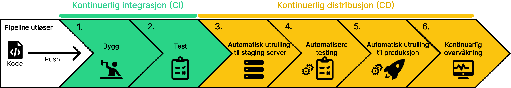

import Experience from "../../../components/Experience.astro";
import LikeThisPage from "../../../components/LikeThisPage.astro";

En CI/CD-pipeline er en serie automatiserte trinn som forbedrer hvordan små endringer integreres i større prosjekter. Dette sikrer at endringene kan dyttes og testes uten å krasje andre deler av applikasjonen. Dette betyr at hver gang en utvikler sender kode til et delt repository (GitHub), vil en pipeline settes i gang.

## Scenario

Du har nettopp blitt ansatt hos en bedrift og skal bidra med å videreutvikle en applikasjon. Bedriften har team bestående av utviklere som jobber med forskjellige deler ved applikasjonen. I løpet av en dag vil mange små endringer forekomme. Hvordan kan vi klare å gjennomføre mange små endringer ved en applikasjon på tvers av ulike teams problemfritt og effektivt? Hvordan kan du sørge for at dine forandringer ikke påvirker og eventuelt krasjer andre deler av applikasjonen?

import SelectCorrect from "../../../components/SelectCorrect.astro";

<SelectCorrect
  question="Hva er formålet med en CI/CD-pipeline?"
  correct="For å automatisere bygging, testing og utrulling av programvare."
  wrong1="For å overvåke ytelsen og tilstanden til applikasjonen."
  wrong2="For å lagre koden på en midlertidig server."
  />

<LikeThisPage />
